# Web Project1 Doc

This is Xinran Duan's project doc for Web pj1.


## 基本信息

- 姓名：段欣然
- 学号：18307130295
- Github 地址：
- Github Pages 地址：
- 开发编辑器：VS Code
- 开发系统：Windows 10，分辨率1920*1280
- 测试浏览器：Google Chrome，Firefox，Microsoft Edge


## 项目简介


#### 项目功能

- 实现一个旅游图片分享平台，包括其基本的登录注册、图片浏览、图片搜索、上传收藏等多种功能。
- 项目共有主页、浏览页、搜索页、上传页、我的收藏页、我的图片页、登录页、注册页、图片详情页，共计九个功能页面。
- 功能页面基本做到布局合理，视觉效果较为符合图片分享网站的标准，配色简洁大方而又富有活力，在不过分改变页面宽度和高度的情况下能够实现响应式布局。
- 所有页面一致使用UTF-8编码，做到正确支持中英文字符的显示和输入，任何页面的任何位置都不出现乱码。
- 使用Google Chrome，Firefox，Microsoft Edge测试，在其中视觉效果基本一致，不出现明显错位现象。
- 代码功能区分明确，有简要的注释。


#### 项目目录

```
.
├── PJ1
|   ├── index.html
|   ├── img
|		├── background
|			├── ornamental-cherry.jpg
|			├── ....
|		├── icons
|			├── arrow-up.png
|			├── ....
|		├── travel-images
|			├── ....
|		├── mdimg
|			├── ....
│   └── src
|		├── css
|			├── browse.css
|			├── ....
|		├── html
|			├── browse.html
|			├── ....
|		├── js
|			├── browse.js
|			├── ....
.
```


#### 项目截图展示

以1920*1280分辨率为例：

##### 主页部分

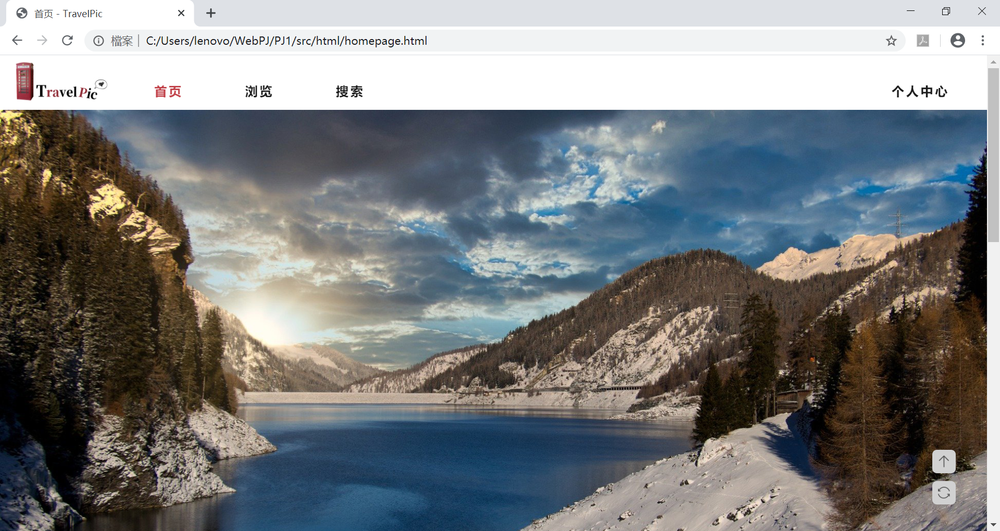

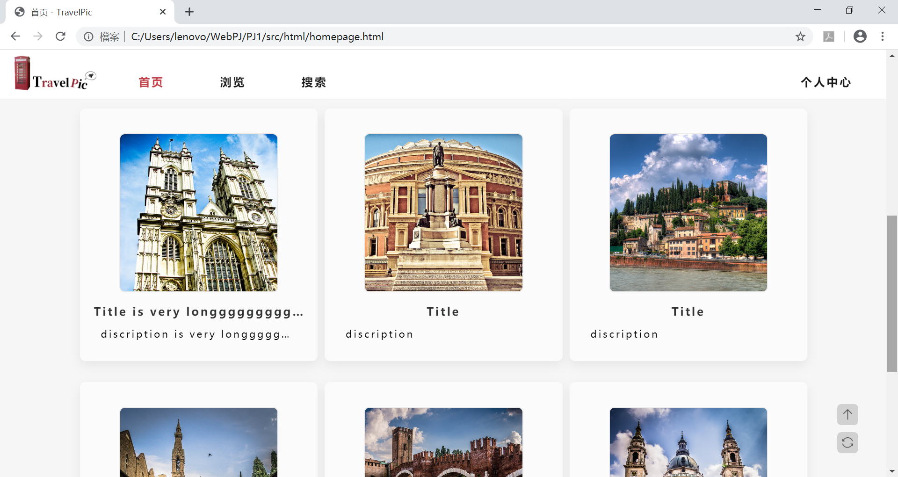

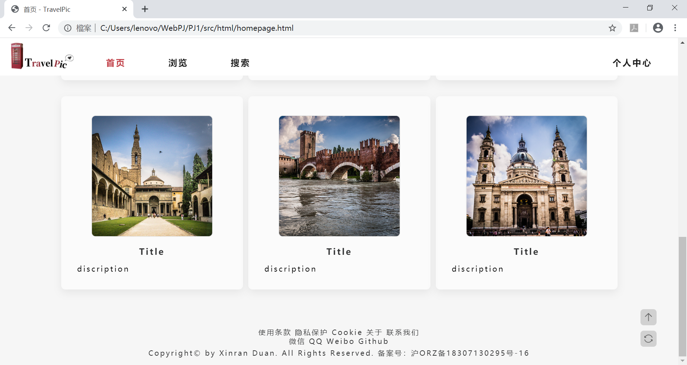

##### 浏览部分

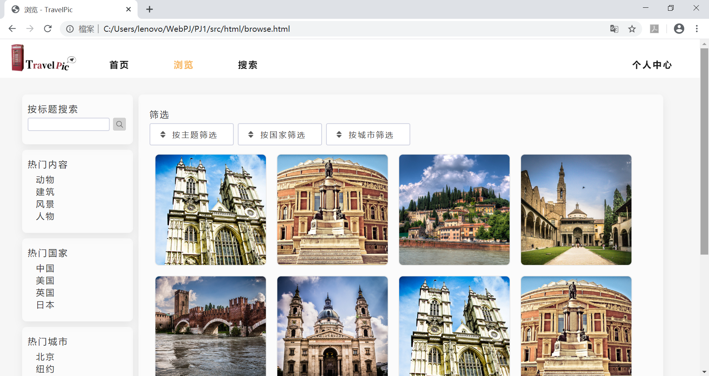

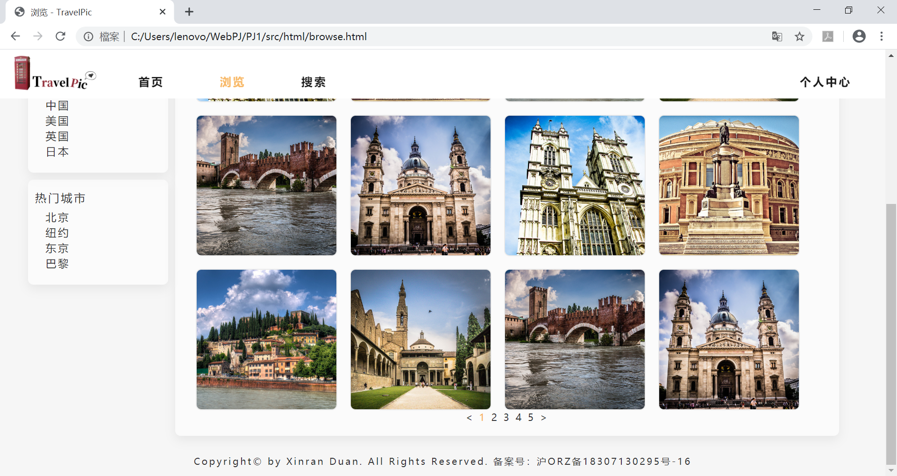

##### 搜索部分

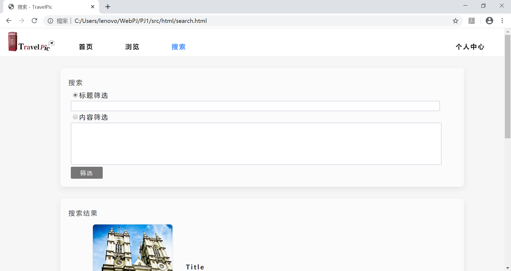

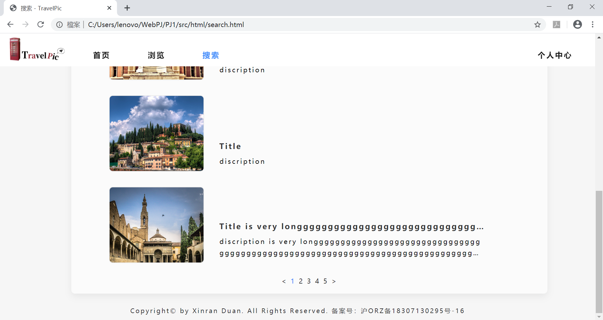

##### 上传部分

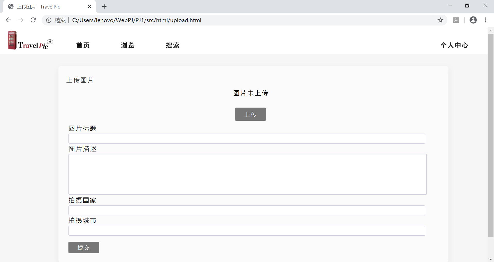

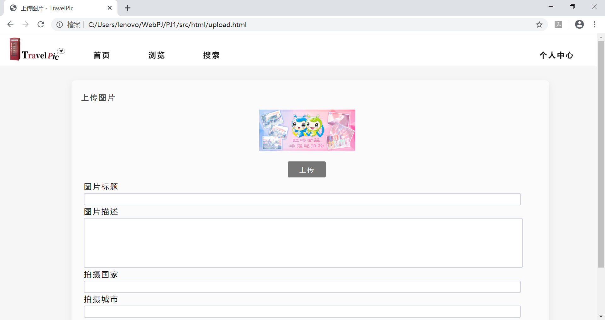

##### 我的照片/收藏/详细信息部分

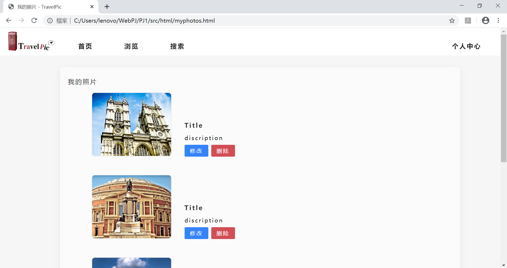

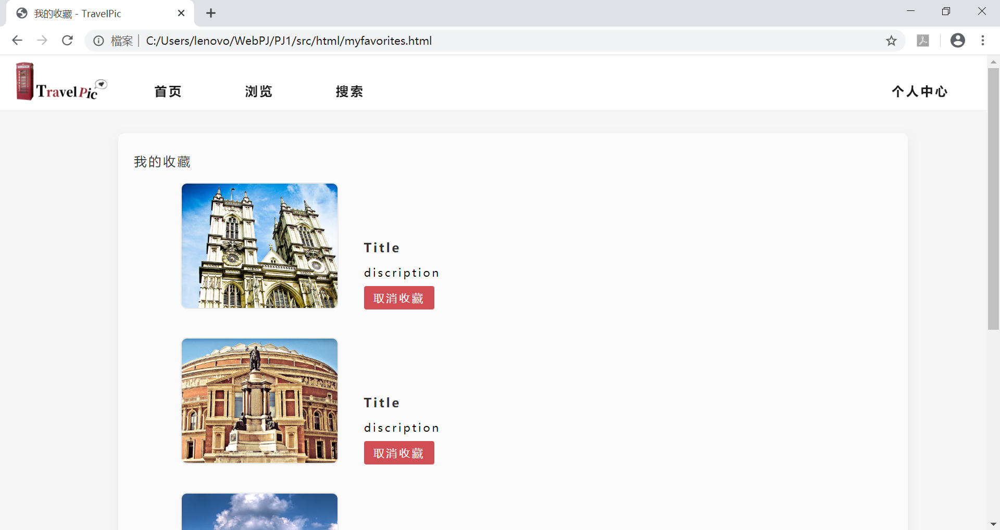

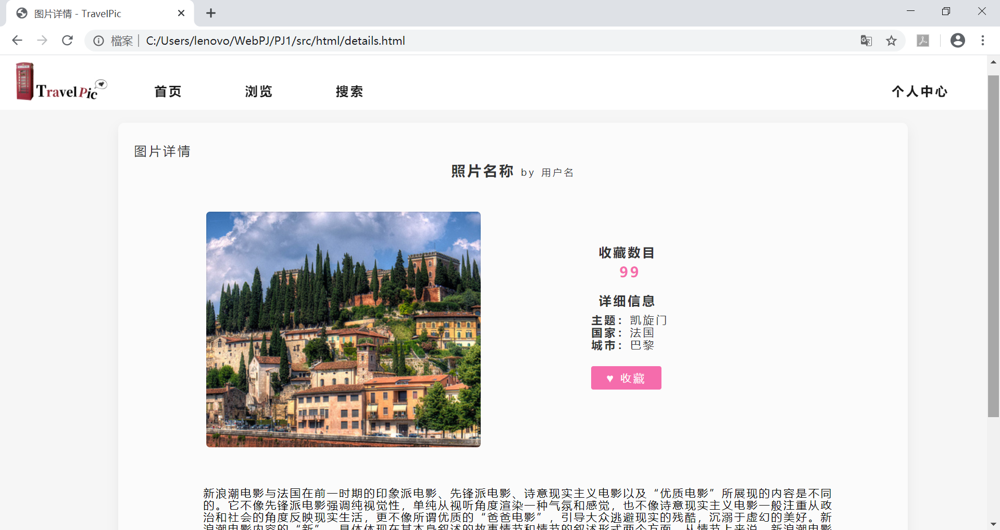

##### 登录/注册部分

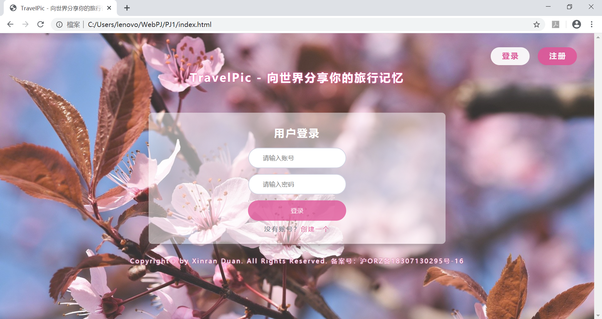

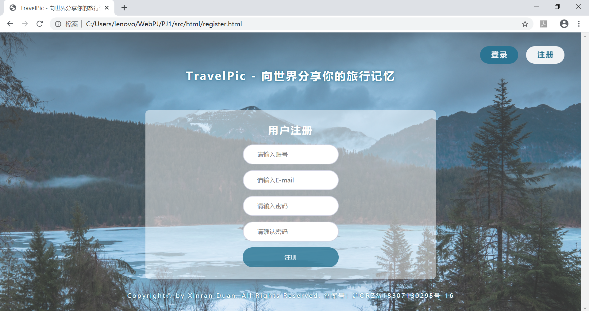


## 项目完成情况


#### 基本要求

- 实现所有评分标准中给出的需求，包括但不限于页面布局、css样式、跳转、按钮alert响应、二级选择器的联动等。


#### Bonus要求

##### 使用自由版式图片

最初是通过在img外面包装一个div，通过裁剪来解决：

```css
.picDisplayBox-detail {
  margin: 15px auto;
  width: 225px;
  height: 225px;
  border-radius:0.5rem;
  border:1px solid rgba(36, 37, 38, 0.08);
  overflow: hidden;
}

.picDisplayBox-detail img {
  width: 100%;
  padding-bottom: 100%;
  position: relative;
  margin-top: -10px;
}
```

但是这个方法的错误在于，它只能裁剪宽<长的图片。

于是我们改变方法，新建一个div，设置大小为固定值，将待裁剪图片设置为它的background，用一个a标签包裹它即可。之后如果要实现自定义图片，可以利用js更改css实现。由于每一页包含的图片数量是有限的，因此可以用有限个id不同的div来实现图片的放置。

具体实现代码见.css（图片样式容器），以及piccss.css文件（实际图片作为背景），以Homepage.html为例：

```css
/*自由样式图片容器*/
.picDisplayBox-detail {
    margin: 15px auto;
    width: 225px;
    height: 225px;
    border-radius: 0.5rem;
    border: 1px solid rgba(36, 37, 38, 0.08);
    overflow: hidden;
}
/*以图片作为div的背景图实现自由样式图片*/
.realPic{
    background-size: cover;
    width: 100%;
    height: auto;
    padding-bottom: 100%;
    overflow: hidden;
    background-position: center 0px;
    background-repeat: no-repeat;
    -webkit-background-size: cover;
    -moz-background-size: cover;
}
#picA {
    background-image: url(../../img/travel-images/normal/medium/5855191275.jpg);
    background-repeat: no-repeat;
}
```


##### 响应式布局

主要实现响应式布局的方法是利用百分比单位%进行布局，伴以使用浮动布局并及时清除，position根据情况使用absolute和relative进行定位，同时对各个div以及图片等元素设置min-width（单位为px），使页面不错位，且不会因挤压而导致内容溢出。在调试过程中，尝试了不同的PC端与手机端分辨率和页面大小，保证页面排版基本显示正常，不影响使用和美观，图片不变形。但在挤压过度的情况下，由于设定了min-width，还是会造成页面的部分元素需要拖动才能显示。


##### 界面美观

参考界面展示部分。


## 意见和建议


pj1考察了很多有关于html和css的知识点，在制作期间我也尝试了使用很多不同种类的元素和排版方式，可以说对于我使用到了的部分有了比较详细的了解。老师和TA都很好，对于问题耐心解答。唯一让我感到遗憾的就是css布局部分讲到得比较晚，导致学习到的时候我的页面布局已经形成，之后再去修改以达到更完美的响应式布局就会比较麻烦。有些知识点的讲解时间和pj布置时间也存在一些顺序颠倒的现象，以至于初期自己走了不少弯路，也需要自学很多新知识，但是收获也比较多。建议今后可以使课程进度和pj进度之间安排得更加合理一些，可以尝试把pj的一些任务分解到lab之中。# 19ss-web-Project1-TravelPic
# 19ss-web-Project1-TravelPic
